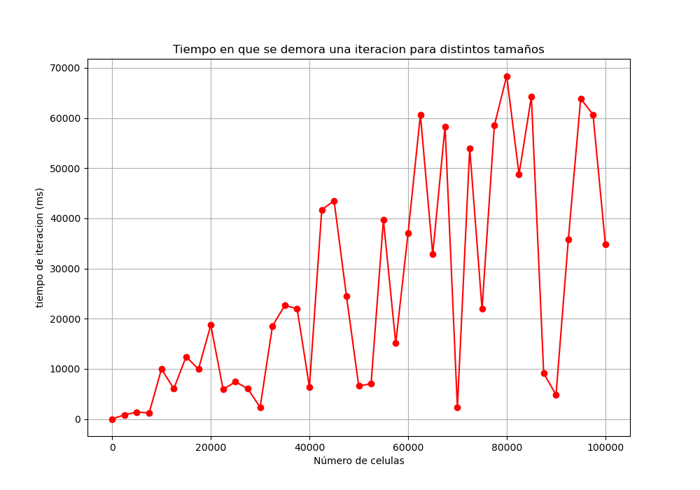
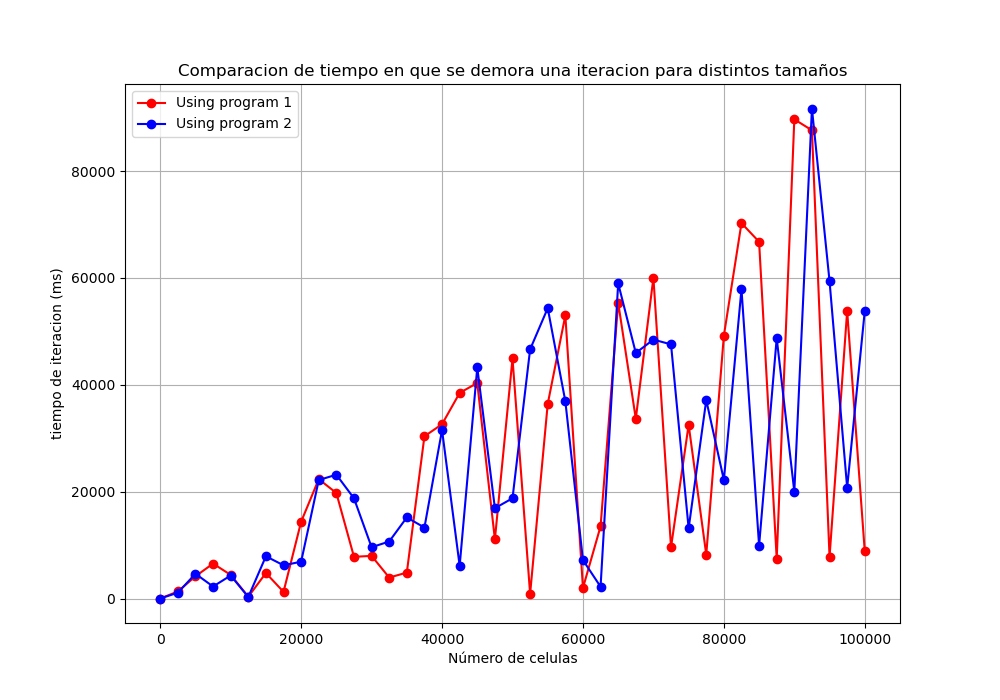

# Juego de la Vida de Conway

Tarea 2 del curso Computacion en GPU sobre distintas implementaciones del juego de la vida de Conway

Compilar las soluciones para despues generar los graficos en python a partir de los ejecutables

Recordar ejecutar los graficos con python desde el working directory correcto: ``t2_computacionGPU/``

### Graficos de prueba generados desde python usando programas compilados

